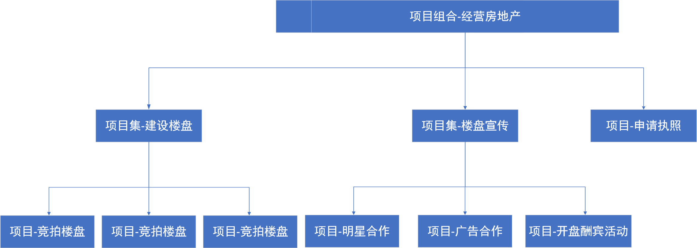

# Project、Program and Portfolio

## 概念说明

- Project即项目，指为创造某一独特产品、服务或者结果所做的一次性努力。
- Program指项目集，是相互关联并且可以通过协调管理的方式获取单独管理所无法取得效益的一组项目。
- Portfolio指项目组合，是跨越Project和Program的项目组合，是为实现战略目标而组合在一起管理的项目、项目集、子项目组合和运营工作。
- Operations在这里指运营，关注的是产品的持续生产和（或）服务的持续运作，它使用最优资源满足客户要求，来保证业务运作的持续高效。它重点管理那些把各种输入（如材料、零件、能源和劳力）转变为输出（如产品、商品和（或）服务）的过程。  
- OPM即组织级项目管理，指为实现战略目标而整合项目组合、项目集和项目管理与组织驱动因素的框架，旨在确保组织开展正确的项目并合适地分配关键资源。

为了更好地说明三者的概念及相互关系，举个🌰——

## Project、Program、Portfolio三者间关系及区别

| To        |             Project              |             Program              |
| --------- | :------------------------------: | :------------------------------: |
| Project   |                -                 |                -                 |
| Program   |   Program是若干个Project的集合   |                -                 |
| Portfolio | Portfolio可以包含有若干个Project | Portfolio可以包含有若干个Program |

另外——

- 项目集和项目的运营管理侧重于如何以"正确"的方式开展项目集和项目。
  - 项目管理注重项目本身的相互依赖关系，以确定管理项目的最佳方法。
  - 项目集管理注重作为组成部分的项目与项目集之间的依赖关系，以确定管理这些项目的最佳方法。

- 项目组合的运营管理侧重于开展"正确"的项目集和项目。

三者之间的关系也可参考摘自教材PMBOK6中的示意图：

## 三者在各方面具体比较

|      | 项目                                                         | 项目集                                                       | 项目组合                                                     |
| ---- | ------------------------------------------------------------ | ------------------------------------------------------------ | ------------------------------------------------------------ |
| 范围 | 项目具有明确目标。其范围是在整个项目生命周期中逐渐明晰的。   | 包括其项目集组件（子项目等）的范围。通过确保各项目集组件的输出和成果协调互补，为组织带来效益。 | 组织范围随着组织战略目标的变化而变化。                       |
| 变更 | 项目经理对变更和实施过程做出预期，实现对变更的管理和控制。   | 项目集的管理方法随着项目各组件成果和/或输出的交付，在必要时接受和适应变更，优化效益实现。 | 项目组合经理持续监督更广泛内外部环境的变更                   |
| 规划 | 整个项目生命周期中，项目经理渐进明细高层级信息，将其转化为详细的计划 | 项目集的管理利用最高层计划，跟踪项目集组件的依赖关系和进展。项目集计划也用于在组件层级指导规划 | 项目组合经理建立并维护与总体项目组合有关的必要过程和沟通     |
| 管理 | 项目经理为实现项目目标而管理项目团队                         | 项目集由项目经理管理，其通过协调项目集组件的活动以确保项目集效益按预期实现 | 项目组合经理可管理或协调项目组合管理人员或对总体项目组合负有报告职责的项目集和项目人员 |
| 监督 | 项目经理监控项目开展中生产产品、提供服务或成果的工作         | 项目集经理监督项目集组件的进展，确保整体目标、进度计划、预算和项目集效益的实现 | 项目组合经理监督战略变更以及总体资源分配、绩效成果和项目组合风险 |
| 成功 | 成功通过产品和项目的质量、时间表、预算的依从性以及客户满意度水平进行衡量 | 成功通过项目集向组织交付预期效益的能力以及项目集交付所述效益的效率和效果进行衡量 | 成功通过项目组合的总体投资效果和实现的效益进行衡量           |
|      |                                                              |                                                              |                                                              |

## 三者对企业成功的贡献

- 企业开展项目是为了实现某种明确目的——往往是像获得收益、获得声誉、建立生态等等对于公司有利的目的，并且因为开展项目作为达成这些目标的主要方法，项目的开展对企业成功的贡献是毋庸置疑的。
- 项目集允许企业内部以协同的方式获取单独管理所无法取得效益的一组项目，这就让项目之间有了“1+1>2”的效果，起到了资源整合的作用，并且能够节省一定开发的重叠成本。
- 项目组合如概念中所说，是为了实现战略目标而组合在一起管理的项目、项目集、子项目组合和运营工作，也就是说项目组合是服务于企业战略方向的，而不仅局限于某一个具体的项目或项目集的目的，因此它相对于项目集能够整合的资源更多，更深入，促进这项工作的有效治理和管理，从而有助于实现组织战略和相关优先级。因此企业能够在更高层次完成战略设计后进行项目组合，进行具体的战略部署实现。

## 三者与运营和组织级项目管理的关系

简而言之，企业战略决定项目组合的价值决策，进而确定纳入组合的项目集和项目，并根据项目集和项目的具体运营成果对所包含的项目集和项目进行实时调整，上图的整个过程表示了组织级项目管理的基本框架。