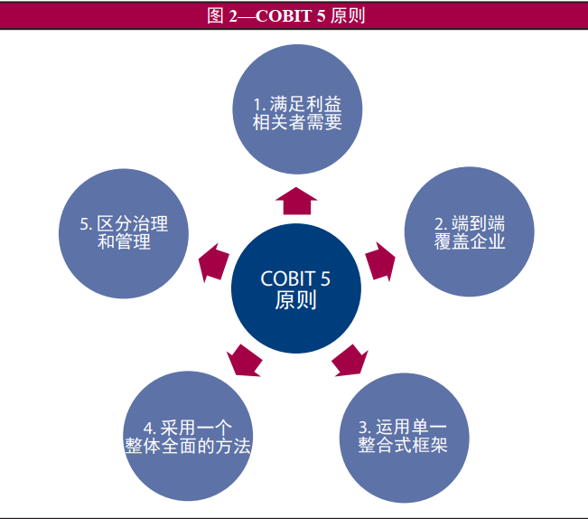
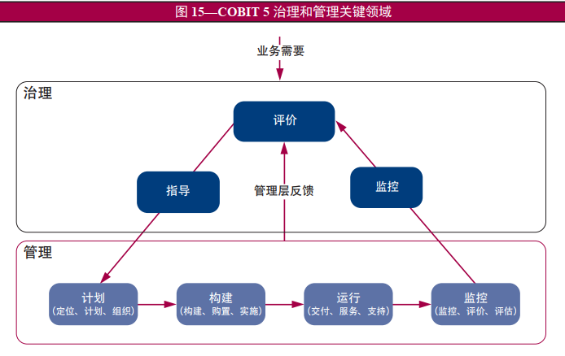

# COBIT5认知——如何运用系统化思维解决行业问题

---

1. 简介

COBIT 5是一个全面性的、以支持企业实现其IT治理和管理目标之业务及管理的框架。简而言之，就是帮助企业通过维持实现利益和优化风险等级和资源利用之间的平衡，从而创造源自于IT的最佳价值。它基于已有的许多架构,如SEI的能力成熟度模型（CMM）对软件企业成熟度5级的划分，以及ISO9000等标准。

2. COBIT 5指导分析解决问题的五大原则及简要分解

- 满足利益相关者的需要
  - 企业的存在就是通过实现收益、优化风险和运用资源之间维持一种平衡，从而为其利益相关者创造价值。
  - 实现该原则的步骤——
    - 确定利益相关者的需要
    - 将利益相关者的需要分解为企业目标
    - 将企业目标分解到IT相关的目标
    - IT相关的目标分解为（第四条原则中指明的）动力目标
- 端到端覆盖企业
  - 将企业IT治理整合进企业治理之中
  - 该方案能覆盖治理和管理企业信息和相关技术所需要的所有功能和流程
- 运用单一整合式框架
  - 保持与其它相关标准和框架保持高度一致
  - 完整地覆盖整个企业，为使用中的其它框架、标准和实践提供有效的整合基础
  - 为构建指引材料和生成一致的产品集提供一种简单的架构
  - 将ISACA各种框架的所有知识整合在一起
- 采用一个整体全面的方法
  - 考虑到各个相互作用的组件，以提供一整套高效率且有效的企业IT治理和管理解决方案
- 区分治理和管理
  - 治理和管理包含不同类型的活动，需要不同的组织结构并服务于不同的用途
  - 治理往往由企业决策层（如董事会或指定机构）负责，职责在于——
    - 对利益相关者的需要、条件和选项进行评估，以确定平衡、协商一致、需要实现的企业目标；
    - 通过优先等级和决策来设定导向
    - 监控商定的导向和目标的绩效和合规性
  - 管理是CEO领导下行政管理层的责任，负责构建并执行治理组织设立

3. 五大原则的系统化分析理解

原则一指明企业活动的目的——满足利益相关者需要

原则二指明方案的使用范围

原则三指明方案的整体框架（及其优越性）

原则四指明方案的方法论并且给出了支持该方案需要的具体因素（动力）

原则五指明方案对于治理和管理的区分

整体而言，COBIT 5指导企业在企业内部确定的范围内（端到端全覆盖），在给出的整体框架下，为了满足利益相关者的需要，治理机构确定企业目标导向，管理层据此策划与导向一致的活动并根据方法论调度完成相关活动所需的动力因素。

现代企业基本离不开IT的使用，即使对于一家房地产公司对外需要进行宣传，对内需要有信息流的传递，因此任何一家公司都能够在不同程度上基于COBIT 5的方案对其企业IT的成熟度进行考量并基于它的五项原则进行相应改造。

对于一家互联网企业，IT技术显然是它的核心技术，根据COBIT 5原则，一般企业活动、利益相关者的目的是盈利；董事会基于这一原则以及当前的社会发展前景，决定把人工智能作为企业发展的目标导向，CEO在内的管理层再基于这一导向确定某一具体项目。倘若客户要求项目符合Val IT、Risk IT等标准，COBIT 5可以提供具体对标的指引。在企业内部贯彻COBIT 5管理原则以及相关这些标准给出的指引，以原则、政策、框架、流程、组织机构、个体或企业的文化道德、行为、信息、服务、基础设施、应用程序、人员、技能和能力等为动力以达成项目目标。