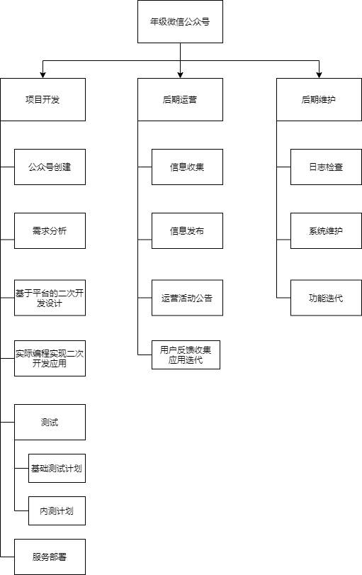
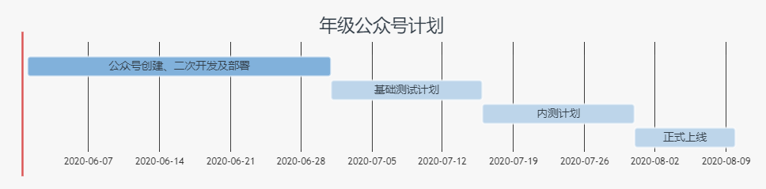
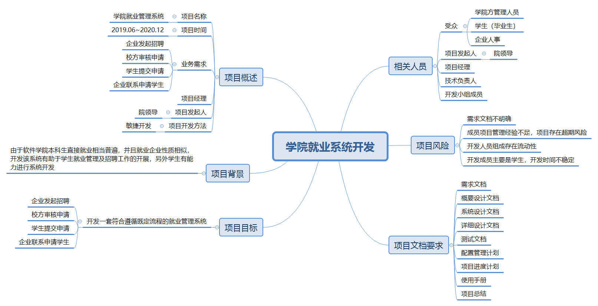

# 分析与工具

---

## 1. 你联合同学做一个年级微信公众号加强各班相互了解、联合活动等。请编制项目章程和项目管理计划，指导该项目实施与运营。必须包含 WBS 和 甘特图。

### 项目章程

- 项目名称：年级微信公众号

- 项目起止时间：2020年6月~2020年8月

- 项目发起人：甲

- 项目经理：甲

- 项目开发团队：乙，丙，丁

- 项目目的：成立年级微信公众号，用于加强各班相互了解、联合活动等

- 项目背景：年级上各班消息传递不便，同学们都依靠相关班委获取信息，交流不便。搭建一个微信公众号可以方便发布信息，便于同学们相互交流。

- 项目目标：成立一个能够提供优质服务的年级微信公众号，方便各班同学们的交流，加强联系及相互了解，便于联合活动的开展以及年级范围内的信息公告通知。

- 进度计划：

> 2020年6月~7月：基于微信平台进行二次开发，完成微信公众号的创建及相关服务的配置
> 
> 2020年8月初~8月中旬：完成基本测试计划（单元测试、集成测试、系统测试）
> 
> 2020年8月中旬~8月末：完成内测计划，并根据需要适当对功能进行小调整
> 
> 2020年8月末：正式上线并在年级范围邀请学生关注并鼓励学生反馈使用体验，根据反馈改善公众号。

- 项目资源：
    - 预算：20000元
    - 服务器一台（学院提供）
    - 开发团队：3人
    - 后期运营：2人

项目风险：

- 开发成员均为学生，开发时间不稳定
- 后期运营成本有可能超过预算
- 项目管理经验不足，可能引起进度延缓
- 后期运营效果或用户体验不佳导致项目流产

### 项目管理计划

- WBS



- 甘特图

<!-- ```mermaid
gantt
    dateFormat  YYYY-MM
    title 年级公众号计划
    section A
    公众号创建、二次开发及部署        :active, des1,2020-06,2020-07
    基础测试计划      :des2,after des1,15d
    内测计划      :des3, after des2, 15d
    正式上线     :des4, after des3, 10d
``` -->


## 3. 召开一个项目策划研讨会，每个人用思维导图记录会议内容，该图必须满足“话题跟踪、热点标注、要点排序、问题汇总”四个基本要求。最后，给出这样会议记录的优点与缺点。



- 优点：
    - 记录要点而不全盘记录，要求与会人员全神贯注，提高开会效率及生产力
    - 有利于找到解决问题的关键因素和环节
    - 对主题进行头脑风暴延伸相关子主题，利于发现不易发掘的外延
    - 独特的“图像记忆”，帮助与会人员有效记忆会议内容，并且与会后可以帮助快速回忆会议内容的重点
    - 与会人员都制作思维导图，可以作为后续资源资产

- 缺点：
    - 尽管只记录要点，但仍然需要考虑什么是会议重点，进行内容的总结，会耗费不少的时间
    - 由于思维导图发散性的特性，不便于表达复杂的信息内容。
    - 使得制成导图后容易被限制思维，降低个人工作效率
    - 制作的思维导图不见得一定易于理解记忆，有时太复杂仍然有难以记忆和理解的问题