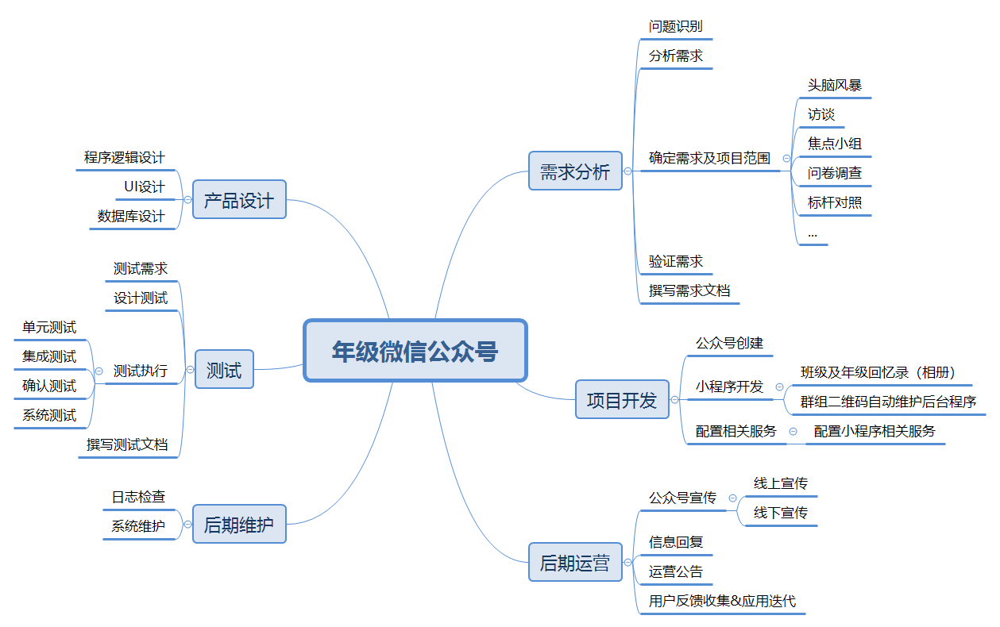
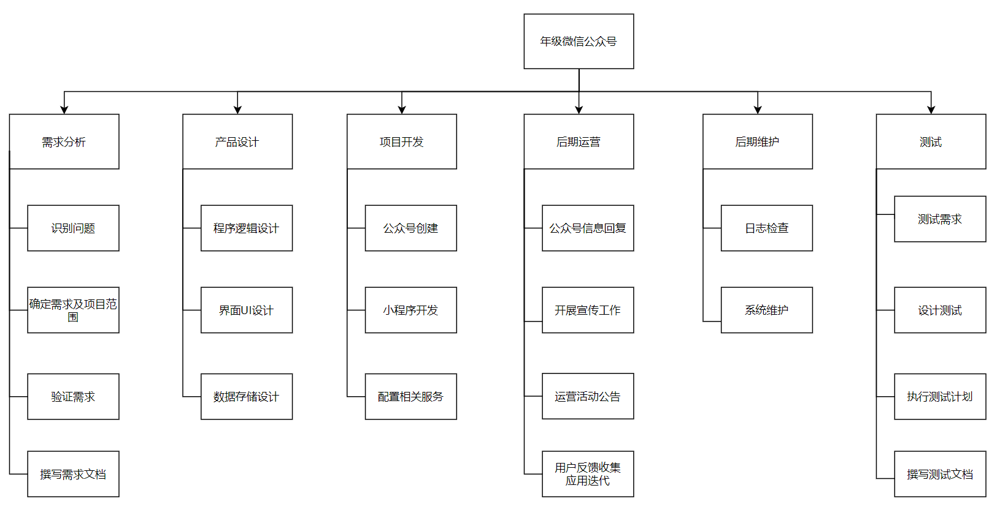

# 分析与工具

---

## 1. 你联合同学做一个年级微信公众号加强各班相互了解、联合活动等。请写一份两页的报告，描述收集需求的方法，并附上收集的需求跟踪矩阵（不少于五个需求）。

### 微信公众号需求报告

#### 需求收集方法

- 头脑风暴
    小组组内成员并邀请若干实际用户开展群体讨论，开放性的收集项目或产品需求。
- 访谈
    对各班班级负责人进行“一对一”访问，因为访谈的形式耗时较长，因此需要有针对性地选择采访对象，而负责人就当前任务而言比较有话语权；对于项目方派遣的采访人员应当选择沟通能力强并且对项目理解较充分的人员，还需适当对采访问题进行设计。
- 焦点小组
    邀请各班代表、学生会成员以及其他能够代表学生群体的组织成员开会讨论该项目对于解决哪些问题有帮助，以及在平时开展活动中有哪些实际需求。另外，可邀请其它有相关项目经验的学校或学院年级微信公众号开发团队参与讨论，并请他们给出具体需求方面的意见。
- 问卷调查
    针对当前项目主题设计一套调查问卷，问卷内容一方面基于已经搜集到的需求询问意见，可设计成打分的方式；另一方面可让调查对象（学生）提出他们的需求；主要的一方面需要使得问卷内容具有挖掘性，能够针对同学们的填写结果挖掘出具体需求。为尽可能防止调查对象失去耐心不愿填写，最好以量表的方式进行，并且题目尽可能精简，题量尽可能少。
- 标杆对照
    查找是否有类似主题的已运营公众号，对运营良好的若干个公众号进行分析研究或直接进行联系询问需求情况，考虑到目标受众理论上并不会冲突，所以经验交流应该是可行的。
- 投票法
    项目小组组织投票，按多数人意愿决定项目范围或产品需求。
- 打分法
    项目小组按照某种计分模型设定权重打分筛选收集到的需求列表。
- 亲和图
    亲和图的构建是一种归纳推理过程。基本的过程是贴上一张便签，然后让大家查看手中的便签，寻找看上去与上一张意义类似的记录；找到后，将其贴到刚才那组便签之下。我们不需要知道同一组便签为什么会被聚在一起，但是我们确实推动了某种“亲和关系”的发生：如果两张便签表达了类似的内容（比如类似的意图，问题或事件），并且与团队的设计重点有关，那么它们就是亲和关系的。因此，决定这些便签是否归在同一类，需要对笔记中的记录深入调查，并理解其代表的实际意义从中挖掘出具体需求。我认为便签的来源可以是与会者撰写，也可以是调查问卷的主观题内容。通过这样的归纳推理过程，最终对需求完成分组、分类及排序。
- 思维导图
    利用思维导图层次化的特点，将需求的关系用相互隶属与相关的层级图表现出来完成对需求的分级和分层工作。
- 名义小组
    选择一些对当前问题有比较深刻理解的人作为小组成员，并向他们提供与决策问题相关的信息。小组成员各自先不通气，请他们独立思考，要求每个人尽可能把自己的备选方案和意见写下来。然后再按次序让他们一个接一个地陈述自己的方案和意见。在此基础上，由小组成员对提出的全部备选方案进行投票，根据投票结果，赞成人数最多的备选方案即为所要的方案。
- 观察与交流
    通过demo演示需求场景，现场与会人员据此提出并交流意见。

### 需求跟踪矩阵

\- 项目名称：年级微信公众号

\- 项目描述：成立一个能够提供优质服务的年级微信公众号，方便各班同学们的交流，加强联系及相互了解，便于联合活动的开展以及年级范围内的信息公告通知。

| 标识 | 关联标识 | 需求描述     | 业务需要、机会、目的和目标                                   | 项目目标                     | WBS可交付成果                  | 产品设计                                                     | 产品开发                                                     | 测试案例                           |
| ---- | -------- | ------------ | ------------------------------------------------------------ | ---------------------------- | ------------------------------ | ------------------------------------------------------------ | ------------------------------------------------------------ | ---------------------------------- |
| 001  | 1.0      | 班级内部管理 | 班级内部设置管理员，方便对班级成员的与信息的管理             | 实现班级人员及信息的有效管理 | 班级管理员名单                 | 各班管理员列成一个名单并且管理员有管理班级人员及信息发布的权限 | 利用微信提供数据库存储管理员信息                             | 设置若干任意人员作为管理员         |
|      | 1.1      | 班级活动发布 | 发布班级级别的活动，收集班级成员意见及参与人员名单           | 辅助完成班级活动的发布及开展 | 班级活动推送接口及信息收集机制 | 参照公众号推文的形式，附带投票等功能                         | 利用微信提供的推文编写工具及其它问卷工具                     | 发布各种内容及回收数据类型的假活动 |
|      | 1.2      | 班级活动展示 | 用于展示班级活动的过程及成果，记录班级生活并为后续活动提供参考 | 记录班级活动                 | 班级活动回忆录模块             | 提供相册功能，可存储图像及视频（文字以描述为主）             | 利用微信小程序实现相关面板，使用云端数据库                   | 上传不同类型不同大小的文件         |
| 002  | 2.0      | 年级活动发布 | 发布年级级别的活动，收集年级成员意见及参与人员名单           | 辅助完成年级活动的发布及开展 | 年级活动推送接口及信息收集机制 | 参照公众号推文的形式，附带投票等功能                         | 利用微信提供的推文编写工具及其它问卷工具（与班级活动一致）   | 发布各种内容及回收数据类型的假活动 |
|      | 2.1      | 年级活动协商 | 班级管理员间协商是否开展活动以及确定活动内容                 | 实现年级范围活动的有效协商   | 班级管理员群组                 | 维护各年级活动协商群组二维码                                 | 使用微信群组功能，仅维护各级群组二维码                       | 在二维码到期后检查是否自动维护     |
|      | 2.2      | 年级活动展示 | 用于展示年级活动的过程及成果，记录年级活动并为后续活动提供参考 | 记录年级活动                 | 年级活动回忆录模块             | 提供相册功能，可存储图像及视频（文字以描述为主）             | 利用微信小程序实现相关面板，使用云端数据库（与班级活动一致） | 上传不同类型不同大小的文件         |
| 003  | 3.0      | 年级通知     | 发布年级通知信息                                             | 信息发布                     | 信息通知页面                   | 提供跳转到信息通知推文的入口                                 | 主要使用公众号推文工具                                       | 发送包含不同多媒体数据的推文       |

### 思维导图

### WBS

