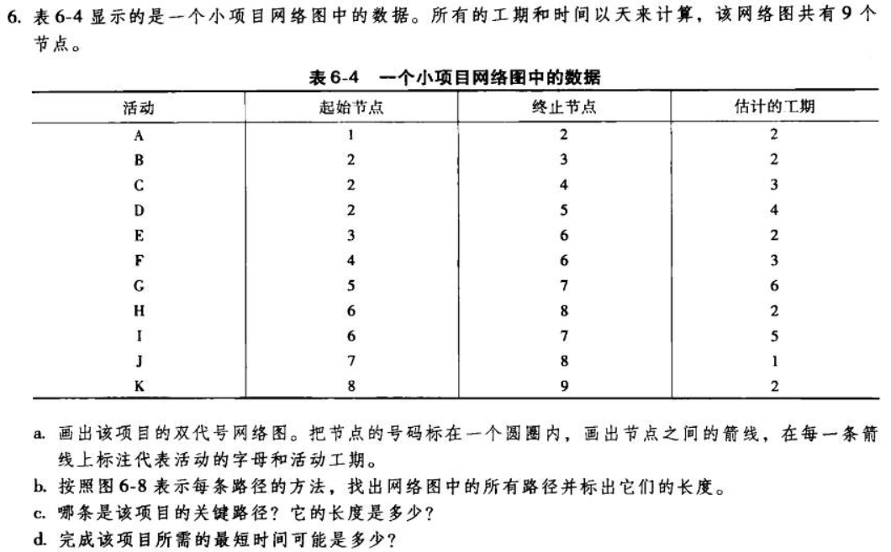
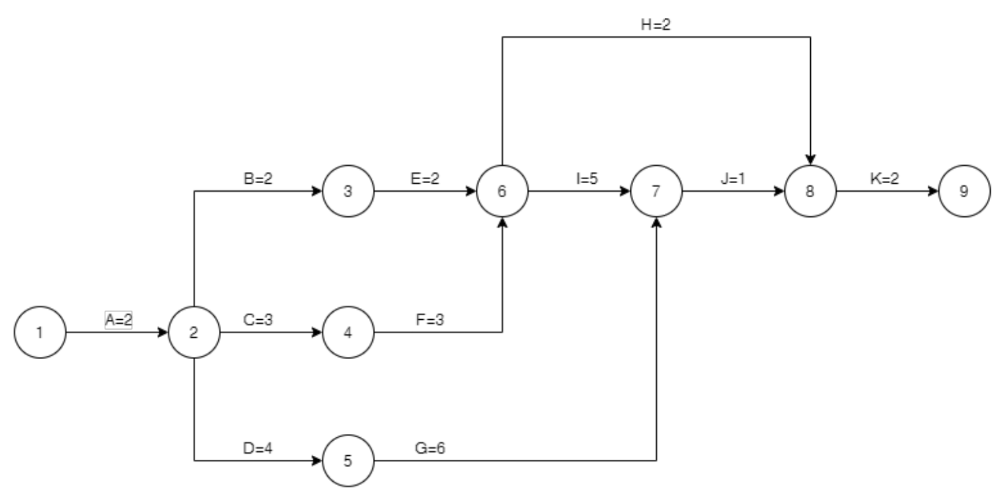
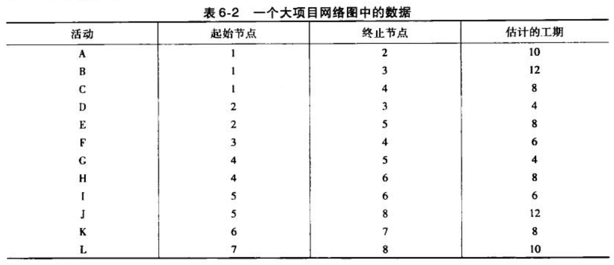
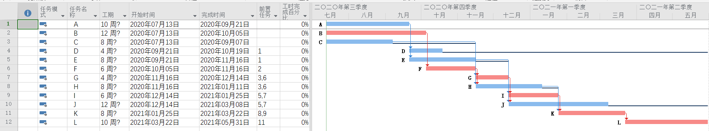
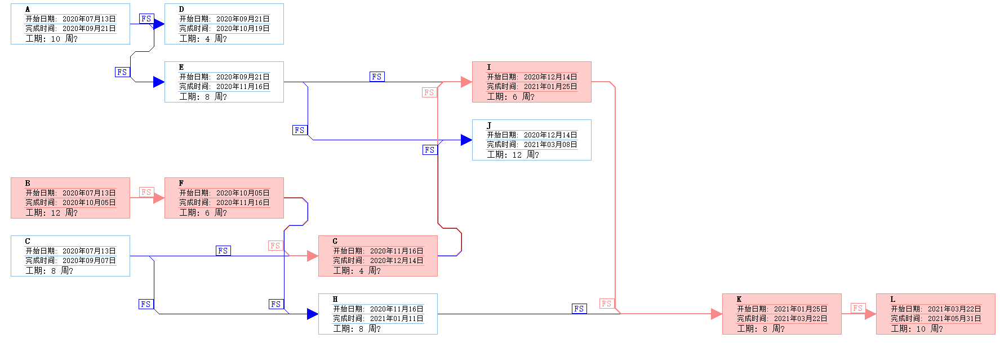
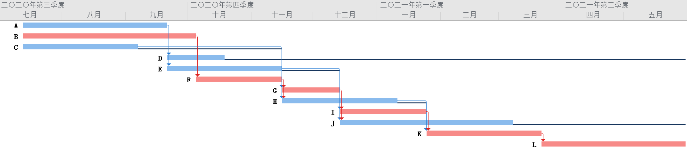
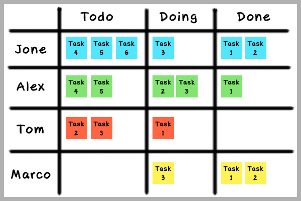
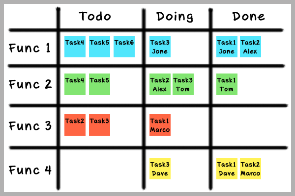

# 项目时间管理

---

## T1

(a) 

(b) 所有路径及长度如下：

路径1：A->B->E->H->K        长度=2+2+2+2+2=10

路径2：A->B->E->I->J->K     长度=2+2+2+5+1+2=14

路径3：A->C->F->H->K        长度=2+3+3+2+2=12

路径4：A->C->F->I->J->K     长度=2+3+3+5+1+2=16

路径5：A->D->G->J->K        长度=2+4+6+1+2=15

(c) 关键路径为路径4：A->C->F->I->J->K，长度为16

(d) 16天

## T2

练习4信息如下：

以下作图使用Project 2019 Professional：

任务进度表：

网络图：

甘特图：

从网络图可直观看出红色路径为关键路径：B->F->G->I->K->L
，长度为46周（230个工作日）

浮动时间差（周）：
|活动|浮动时差|总时差|
|--|--|--|
|A|0|4|
|B|0|0|
|C|10|10|
|D|32|32|
|E|4|4|
|F|0|0|
|G|0|0|
|H|2|2|
|I|0|0|
|J|12|12|
|K|0|0|
|L|0|0|

甘特图说明的是一系列与项目相关的任务和时间组合，通过代表任务的横条在时间坐标上的位置和跨度来直观地反映任务的相关时间信息（开始时间、工期、结束时间）；通过横条的不同图像特征（实心条、空心条等）来反映任务的不同状态；通过用带箭头的线来反映任务间的逻辑关系，我们能够使用它来有效地对项目进行进度管理，它的优势是图形化概要，易于理解，能传递大量信息。上面的甘特图中红色的表示关键路径上的活动，蓝色的则是非关键路径上的活动，箭头从一个活动的尾端指向另一个活动的开始表示前一个活动是后一个活动的前置。另外黑色的线表示该活动可宽延（宽限）的时间。
网络图和甘特图一样，可以分解任务并体现各项任务的开始和结束时间，不过以这种形式可以更加显式的描绘各个作业彼此间的依赖关系及活动顺序，这使得它在应对计划中有很多子任务而且彼此之间的关系比较复杂的情况要优于甘特图，另外使用网络图可以更加清晰地去找到并分析关键路径，因为上述原因它更加便于对任务的时间管理进行优化，起到缩短工期或优化资源分配等作用。具体而言上图中每个方框表示一个活动，活动使用箭线连接其它活动，射出端是前置活动，根据射入射出端是活动的开始和结尾可分为四种依赖类型。另外，和甘特图一样，红色的同样标识关键路径。

## T3 收集网上资料，总结看板在软件项目中的使用（约2-3页）

看板是敏捷开发常用的管理工具之一，因为在敏捷开发的团队中，人人都要有产品的意识，都要对项目过程有足够清晰的了解，它能够使得不同的项目参与角色都能见证项目的开展过程，并且对于不同的角色能够带来不同的好处：

- 对于客户而言，敏捷开发虽然拥抱变化，但有时也可能出现技术瓶颈或者其他问题，客户如果有需要，能够通过观察看板了解项目进展。
- 对于项目经理而言，需要保证项目进度的可控性，而有了看板，每位开发人员具体的工作进度都能清晰的展示在看板墙上，这就使得项目经理能够轻易地了解到项目的具体开发进度。
- 对于开发经理而言，资源的合理分配是十分重要的，但这一任务同样需要对人力的使用情况和项目情况有充分的了解才能够实现，看板就能够帮助实现这一目标。
- 对于开发人员而言，绩效考核可能出现不够公开透明的问题，而使用看板就能够比较好的解决这个问题,每个人的工作成果都直观地展示出来，一方面绩效考核有清晰的依据；另一方面，开发人员会知道其他开发人员的工作进展和内容，知道哪里遇到了问题应该和谁共同，也可以对开发的内容也能清晰地沟通；并且这种方式也可以起到激励作用。

在实际的使用中看板主要有以下两种形式：

- 实体看板
    这是敏捷开发团队中用的最多，最直接的一种看板类型，且适合团队所有成员都在一个办公室工作的环境。它的优点一目了然，方便工作成员展示自己的任务和进度，另一方面则可以提高成员间互相竞争的意识（谁干的多，谁解决的问题越难，成就感就越强）。当然，缺点也很明显，就是没有历史记录。
    实体白板在项目管理需要使用的元素有：白板、列表(纵向列表、横向泳道)便签纸、图钉、磁铁
- 互联网式的看板
    即使是敏捷开发，团队成员也不见得一直会在办公室里进行开发，更有甚者，对于网上协同开发的团队或者处于特殊场景下的软件团队可能并不使用实体看板，而是使用在线的看板工具，这些看板工具被集成在许多的项目管理软件中，包括Github、Gitlab、Confluence、Trello、WeKan、leangoo等。

不同的项目管理者或者说对于不同的任务，在使用看板时可能会采用不同的方式，按照任务分配的主导人有以下两种：

- 项目管理者主导

所有的工作内容由项目管理者按照开发人员的工作能力和技能直接分配，使用这种方式要求项目管理者对于开发人员有足够的了解。

- 成员主导

下图这种类型虽然由开发人员主导，但具体的任务清单还是由项目管理者来进行划分的，只是他不做分配，由开发人员自行决定任务分配。关于开发人员为什么要抢的问题，前提当然是成员自己认为能够胜任这个任务，然后看板应该作为绩效考核，实现多劳多得的机制。

当然，具体的看板使用和实现细节还需视任务和参与者决定。

总而言之，通过看板能够使团队把握好一个适合大部分团队成员的的开发节奏，建立起一个具有默契的、不断进取的、能够稳定产出的高效团队（当然这要求每个团队成员都对自己有足够高的要求）。这样的一个团队加之看板这一开发过程透明化的工具，能够帮助团队与客户、相关部门、供应商等合作伙伴建立起可靠的信任关系和长期的合作友谊。
