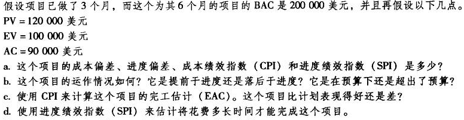

# 项目成本管理

## 项目成本估计

| WBS条目 | 数量或小时数 | 单位小时成本（美元） | 子层总和 | WBS第2层总和（美元） | 占总和的% |
|::|::|::|::|::|::|
| **1.项目管理** |  |  |  | 105600 | 52.8 |
| 项目经理 | 480 | 100 | 48000 |  |  |
| 项目团队成员 | 960 | 60 | 57600 |  |  |
| **2.需求定义** |  |  |  | 2500 |  |
| **3.网站设计** |  |  |  | 30000 | 15 |
| 3.1 娱乐节目的注册 |  |  | 8500 |  |  |
| 3.2 班级和节目的注册 |  |  | 8000 |  |  |
| 3.3 跟踪系统 |  |  | 8000 |  |  |
| 3.4 奖励系统 |  |  | 5500 |  |  |
| **4. 网站开发** |  |  |  | 49000 | 24.5 |
| 4.1 娱乐节目的注册 |  |  | 15000 |  |  |
| 4.2 班级和节目的注册 |  |  | 13000 |  |  |
| 4.3 跟踪系统 |  |  | 12000 |  |  |
| 4.4 奖励系统 |  |  | 9000 |  |  |
| **5. 测试** | | |  | 8000 | 4 |
| **6. 测试、运行和支持** | | | | 4900 | 3.45 |

## 2. 使用以上成本模型，通过按WBS分配成本，为这个项目每个月制定成本基线

| WBS条目               | 1    | 2    | 3    | 4    | 5    | 6    | 总和   |
| --------------------- | ---- | ---- | ---- | ---- | ---- | ---- | ------ |
| 1.项目管理            |      |      |      |      |      |      |        |
| 项目经理              | 8000 | 8000 | 8000 | 8000 | 8000 | 8000 | 48000  |
| 项目团队成员          | 9600 | 9600 | 9600 | 9600 | 9600 | 9600 | 57600  |
| 2.需求定义            | 2500 |      |      |      |      |      | 2500   |
| 3.网站设计            |      |      |      |      |      |      |        |
| 3.1  娱乐节目的注册   | 3000 | 5500 |      |      |      |      | 8500   |
| 3.2  班级和节目的注册 | 3000 | 5000 |      |      |      |      | 8000   |
| 3.3  跟踪系统         | 3000 | 5000 |      |      |      |      | 8000   |
| 3.4  奖励系统         | 2000 | 3500 |      |      |      |      | 5500   |
| 4. 网站开发           |      |      |      |      |      |      |        |
| 4.1  娱乐节目的注册   |      | 3000 | 7000 | 5000 |      |      | 15000  |
| 4.2  班级和节目的注册 |      | 3000 | 6000 | 4000 |      |      | 13000  |
| 4.3  跟踪系统         |      | 3000 | 4000 | 5000 |      |      | 12000  |
| 4.4  奖励系统         |      | 3000 | 4000 | 2000 |      |      | 9000   |
| 5. 测试               |      |      | 2500 | 3000 | 2500 |      | 8000   |
| 6. 测试、运行和支持   |      |      |      |      | 2000 | 2900 | 4900   |
| 总和                  |      |      |      |      |      |      | 200000 |

## 3. 

a.

项目的成本偏差CV=EV-AC=100000-90000=10000

项目的进度偏差SV=EV-PV=100000-120000=-20000

项目的成本绩效指数CPI=EV/AC=100000/90000=111%

项目的绩效指数SPI=EV/PV=100000/120000=83%

b.

这个项目进度目前落后于预期，但目前花费的成本还是低于预期的，因此可能需要加增加开销以加快进度。

c.

完工成本估计EAC=BAC/CPI=200000/111%=180180美元，从成本来看该项目比计划表现得好。

d.

完工时间估计=BAC/SPI=6/83%=7.2月

因此估计需要花费7.2个月才能完成这个项目。
