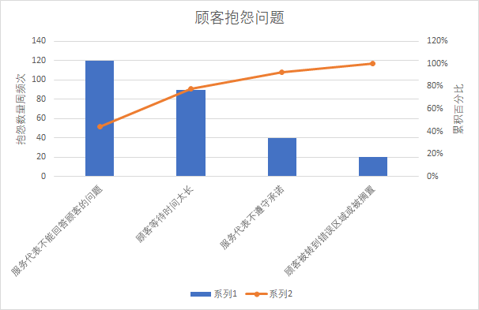

# 项目质量管理

## 1.假定你的组织想聘用新教师来教授项目管理课程。指定一个质量标准的清单，可用于做出此次聘用决定

聘用标准如下：

- 项目管理方面有一定研究成果的优先
- 自身素养方面，要热爱教育事业，教学经验丰富；要具有较广博的文化基础知识和业务水平，既精通自己担任的课程，还要懂得其他学科知识；
- 211以上重点大学的硕士/博士学历
- 拥有4年以上项目管理经验或有2年以上项目管理教学经验
- 若有10年以上项目管理经验或5年以上项目管理教学经验可适当降低学历标准

## 2

## 3

两个骰子和的分布为：
|点数|2|3|4|5|6|7|8|9|10|11|12|
|:--:|:--:|:--:|:--:|:--:|:--:|:--:|:--:|:--:|:--:|:--:|:--:|
|概率|1/36|2/36|3/36|4/36|5/36|6/36|5/36|4/36|3/36|2/36|1/36|

根据大数定理，若骰子数足够大时近似正态分布，但现在只有两个骰子并且投掷次数较少，并不能很好地近似正态分布。
